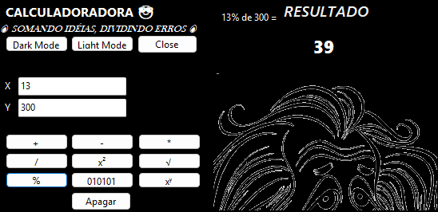
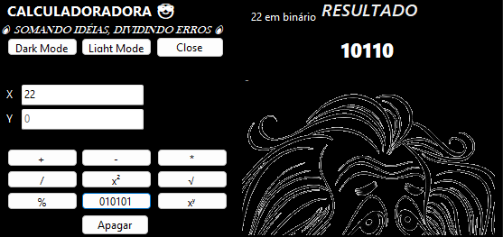
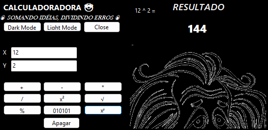

# Win Form Calculator

Este é um simples projeto, feito em Windows Forms com o C#, de uma calculadora de operações básicas e comuns.

## 💻 Demonstração do programa:

## 😶‍🌫️ Funções extras 😶‍🌫️:

● Conversão de decimal para binário:

● X elevado a potência de Y:

Baixe a versão do programa [aqui]()